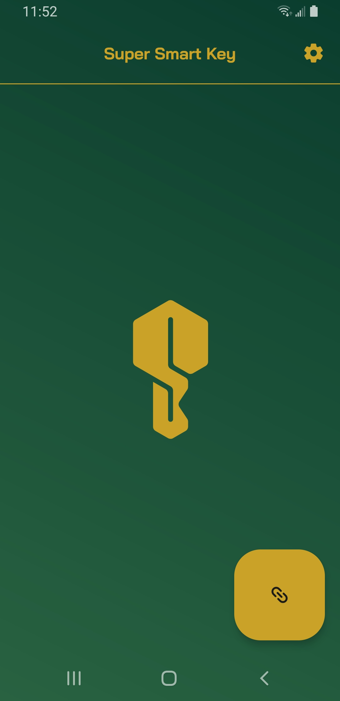
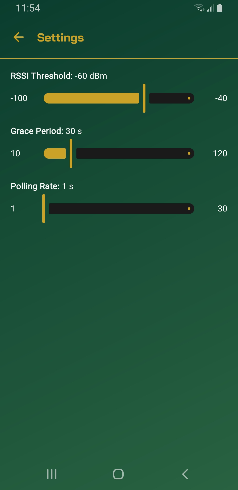
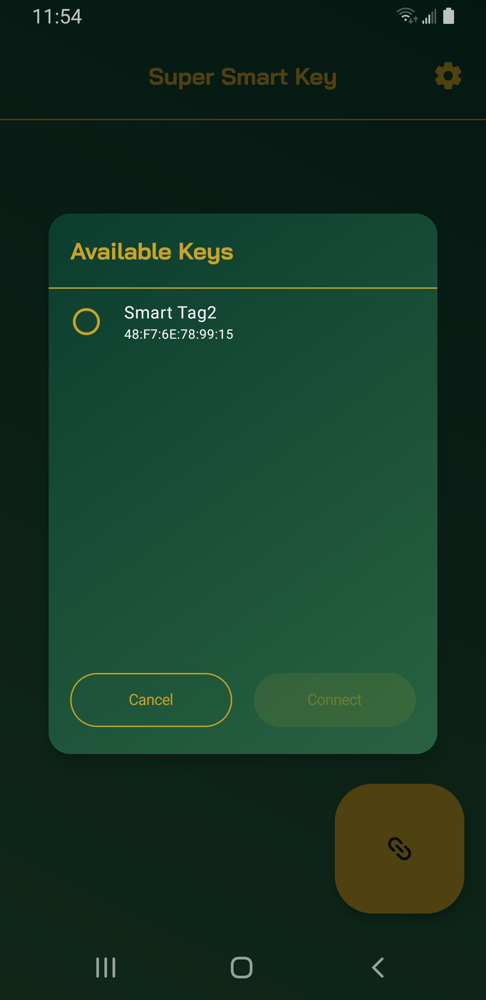
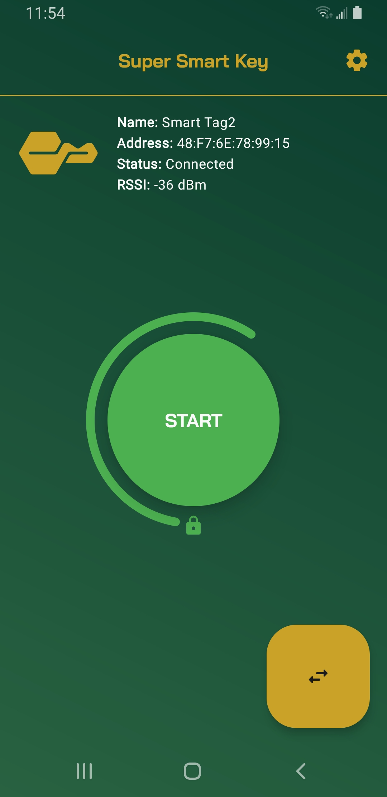
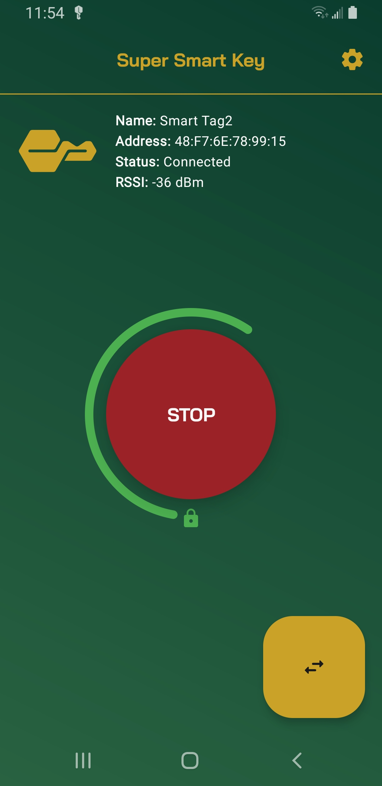
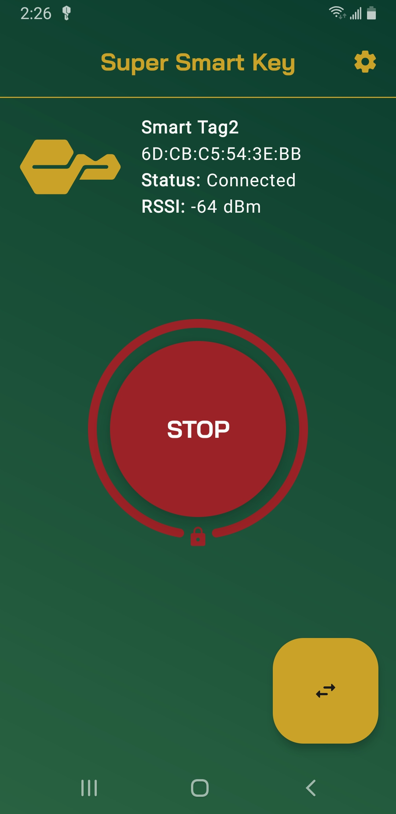

<h1 align="center"><b>Super Smart Key</b></h1>

  

 

Have you ever wished that your phone would automatically lock when you walked away from it? Me
neither, but my Dad did, so this project exists to solve that problem.

Super Smart Key is an Android 9+ app that turns connected Bluetooth devices into smart keys that
automatically lock your device when they move out of a configurable range.

## Screenshots

  
  

## How It Works

Super Smart Key uses Bluetooth RSSI (Received Signal Strength Indicator) to approximate the distance
to a Bluetooth device. Currently, the app requires Bluetooth devices to be already connected to
the mobile device to be considered a potential key candidate.

To get started, tap the link button in the bottom right to link to an available key.
Since the distance approximation can be influenced by obstructions or device output variability,
it's helpful to observe the RSSI of the key from a desirable position. Then, set a suitable RSSI
Threshold in settings, accessible via the gear button in the top right, before starting the service.

Once the service is started, a notification will appear to indicate its presence. The service will
periodically check for the RSSI of the linked key and if the read value is below the RSSI Threshold,
or the key has disconnected, it will lock the device. The service can be stopped at any time from
the notification or by pressing the button within the app.

> [!NOTE]
> Not all Bluetooth devices support RSSI reading. Verify the key status is `Connected` and the RSSI
> value is changing before starting the service.

> [!TIP]
> Bluetooth beacons are solid key candidates. In fact, this project primarily used a Galaxy
> SmartTag2 for testing.

## Settings

- RSSI Threshold [-100, -40] (dBm)
    - The minimum signal strength required to keep the device unlocked. A higher RSSI threshold
      generally requires a shorter distance between the device and key before locking.
- Grace Period [10, 120] (s)
    - The minimum time between consecutive locks. A higher grace period allows more time to turn off
      the service in the event of key loss.
- Polling Rate [1, 30] (s)
    - The frequency of key signal strength checks. A higher polling rate uses less system resources
      but makes the service less responsive to changes in key position.

## Permissions

- Bluetooth (`BLUETOOTH_SCAN`, `BLUETOOTH_CONNECT` on Android 12+ otherwise, `BLUETOOTH`,
  `BLUETOOTH_ADMIN`, `ACCESS_FINE_LOCATION`)
    - To connect to Bluetooth devices and use them as keys.
- Services (`FOREGROUND_SERVICE`, `FOREGROUND_SERVICE_CONNECTED_DEVICE`)
    - To communicate with keys and run the key service in the background.
- Notifications (`POST_NOTIFICATIONS`)
    - To indicate when the key service is running in the background.
- Device Admin (`force-lock`)
    - To allow keys to lock the device when out of range.

## Tech

## License

Super Smart Key is licensed under the [GNU General Public License v3.0 (GPLv3)](LICENSE).
