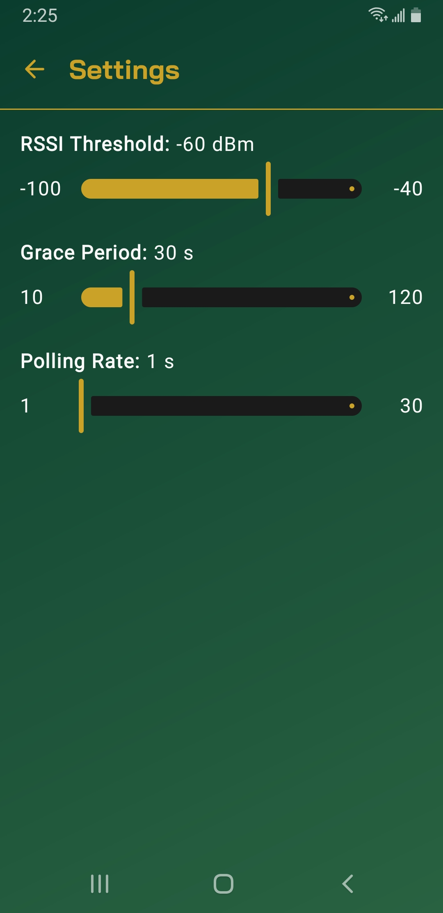
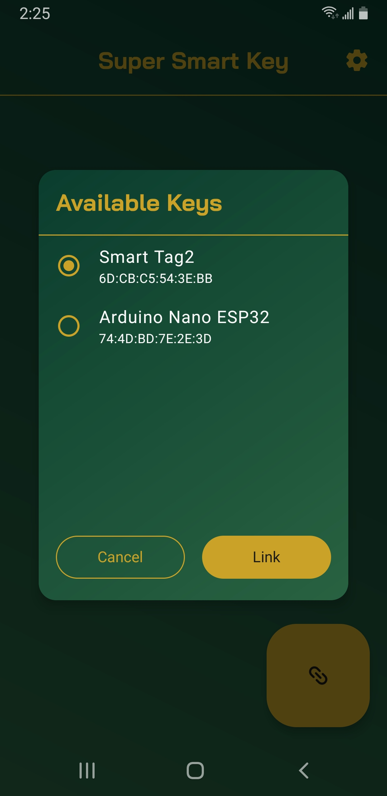

# Super Smart Key

Have you ever wished that your phone would automatically lock when you walked away from it?
Me neither, but my Dad did, so this project exists to solve that problem.

Super Smart Key is an Android 9+ app that turns connected Bluetooth devices into smart keys that
automatically lock your device when they move out of a configurable range.

## Screenshots

  
  

## License

Super Smart Key is licensed under the [GNU General Public License v3.0 (GPLv3)](LICENSE).