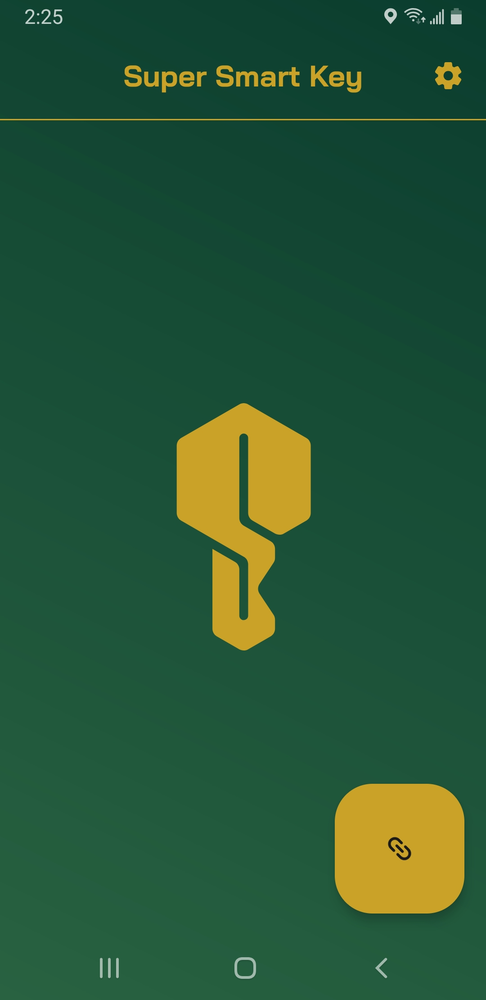
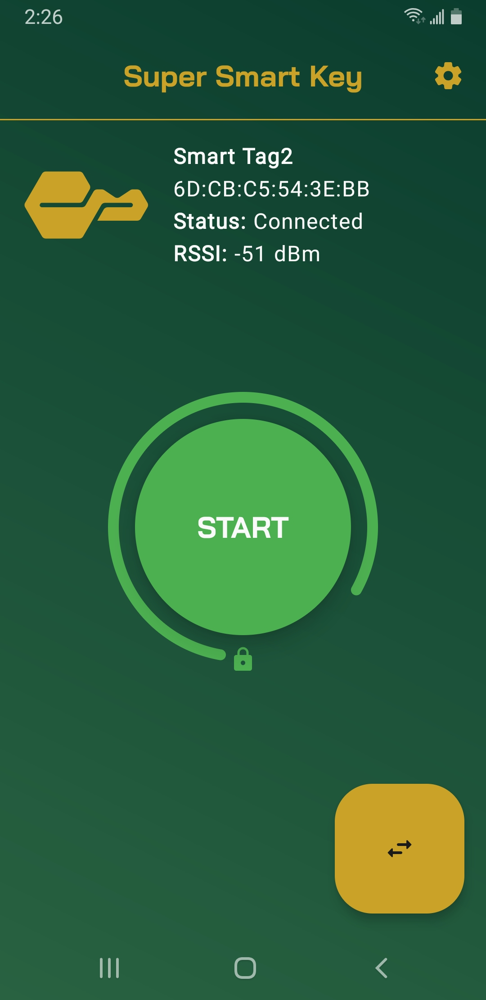

<h1 align="center"><b>Super Smart Key</b></h1>

Have you ever wished that your phone would automatically lock when you walked away from it?
Me neither, but my Dad did, so this project exists to solve that problem.

Super Smart Key is an Android 9+ app that turns connected Bluetooth devices into smart keys that
automatically lock your device when they move out of a configurable range.

## Screenshots

  
  

## Settings
- RSSI Threshold [-100, -40] (dBm)
    - The minimum signal strength required to keep the device unlocked. A higher RSSI threshold generally requires a shorter distance between the device and key before locking.
- Grace Period [10, 120] (s)
    - The minimum time between consecutive locks. A higher grace period gives users more time to turn off the service in the event of key loss.
- Polling Rate [1, 30] (s)
    - The frequency of key signal strength checks. A higher polling rate uses less system resource but makes the service less responsive to changes in key position.

## Permissions

- Bluetooth (`BLUETOOTH_SCAN`, `BLUETOOTH_CONNECT` on Android 12+ otherwise, `BLUETOOTH`, `BLUETOOTH_ADMIN`, `ACCESS_FINE_LOCATION`)
    - To connect to Bluetooth devices and use them as keys.
- Services (`FOREGROUND_SERVICE`, `FOREGROUND_SERVICE_CONNECTED_DEVICE`)
    - To communicate with keys and run the key service in the background.
- Notifications (`POST_NOTIFICATIONS`)
    - To indicate when the key service is running in the background.
- Device Admin (`force-lock`)
    - To allow keys to lock the device when out of range.

## License

Super Smart Key is licensed under the [GNU General Public License v3.0 (GPLv3)](LICENSE).
